# User Management App (Technical Test)

Aplikasi web sederhana berbasis CodeIgniter 3 dengan fitur login, role-based access, CRUD user dan artikel, serta upload file.

## 🔧 Teknologi
- CodeIgniter 3 (PHP)
- MySQL
- CSS murni (tanpa framework)
- JavaScript
- JWT untuk autentikasi API

## 📸 Screenshot

### Halaman Login
Tampilan halaman login awal dengan ReCaptcha

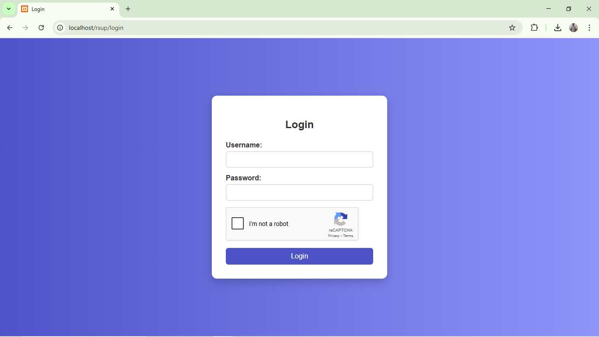

Validasi field username dan password

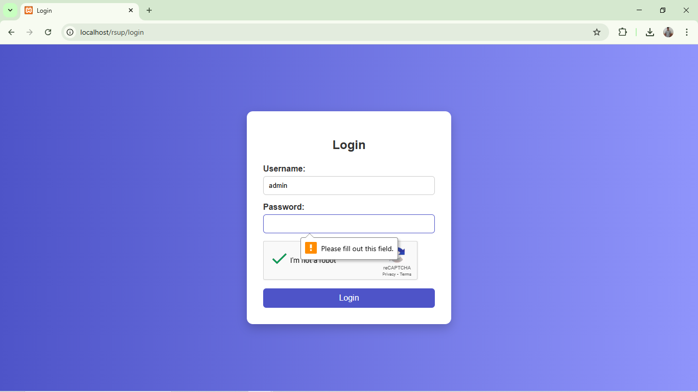

Validasi ketika berusaha login tanpa ReCaptcha

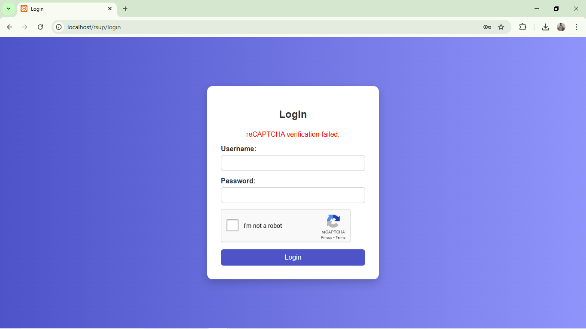

### Dashboard
Halaman Dashboard awal ketika berhasil login

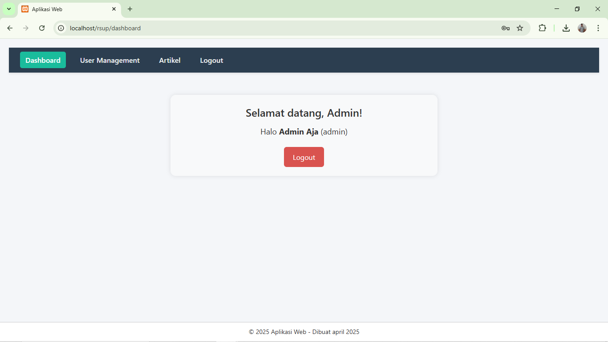

### Halaman Maintenance User
Halaman Maintenance User bagian atas, halaman maintenance user ini hanya bisa diakses dengan login role admin

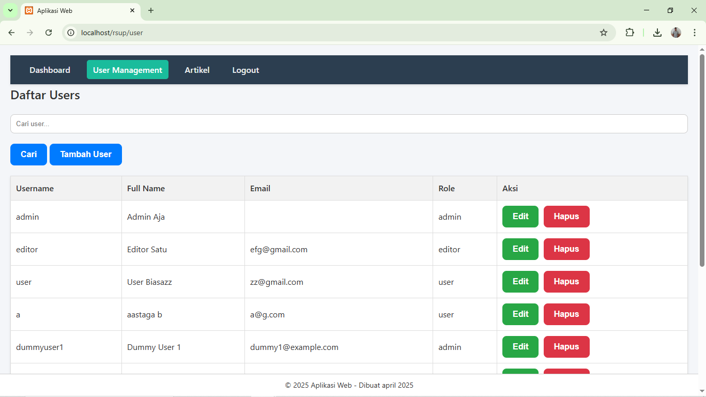

Halaman Maintenance User bagian bawah

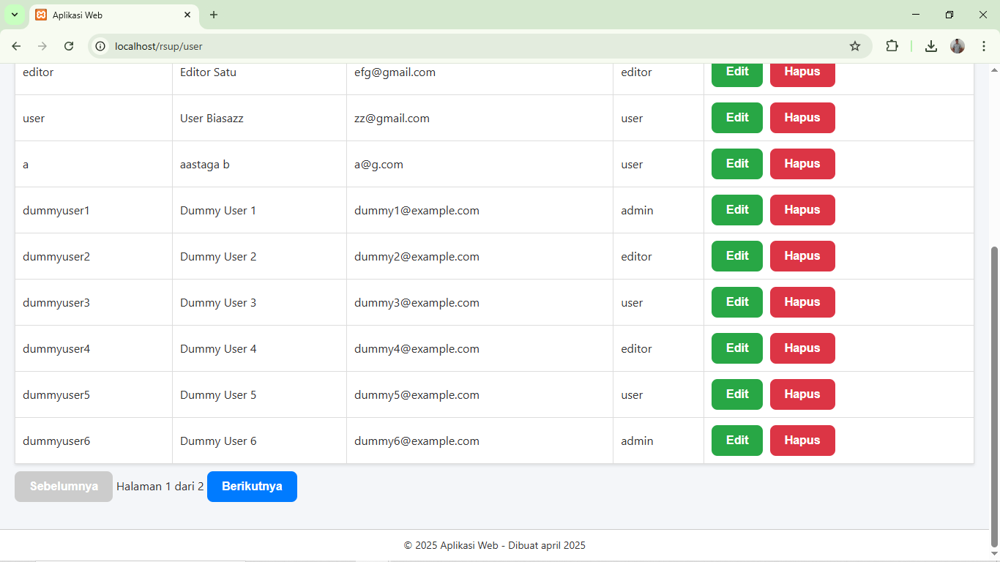

Tampilan tambah User

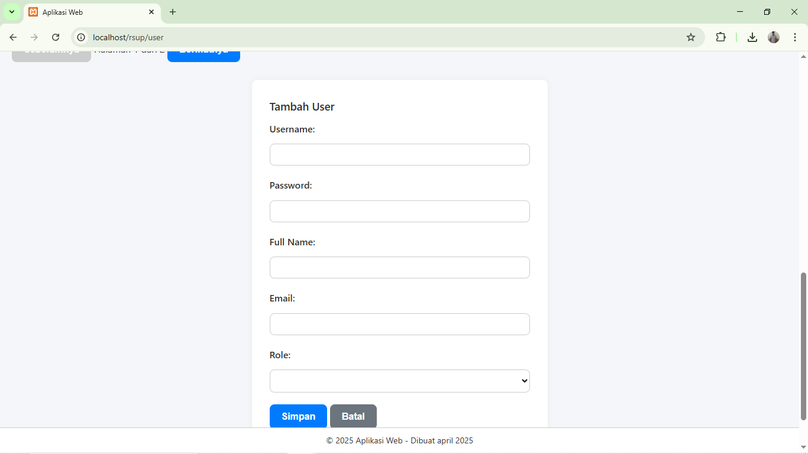

Validasi field ketika hendak menambahkan User

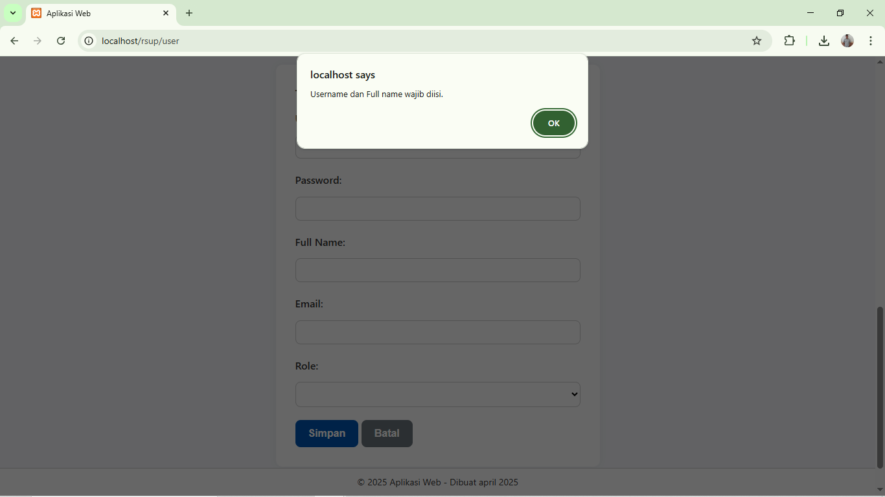

Validasi field email apakah email yang valid atau tidak


### Halaman Maintenance Artikel
Halaman Artikel dengan login sebagai admin, ada fitur tambah artikel, edit artikel, dan hapus artikel

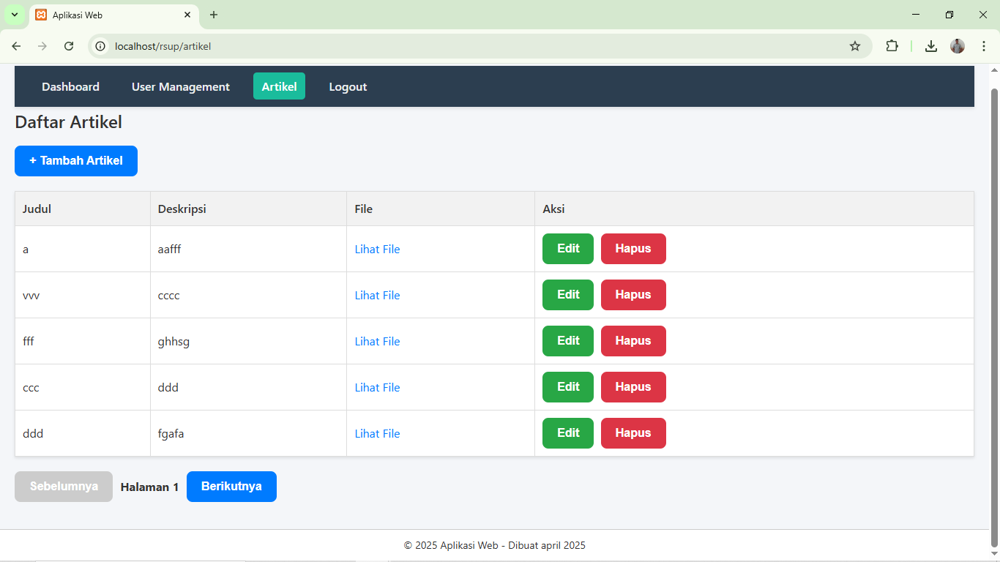

Halaman Artikel dengan login sebagai editor, hanya ada tambah dan edit artikel tanpa hapus

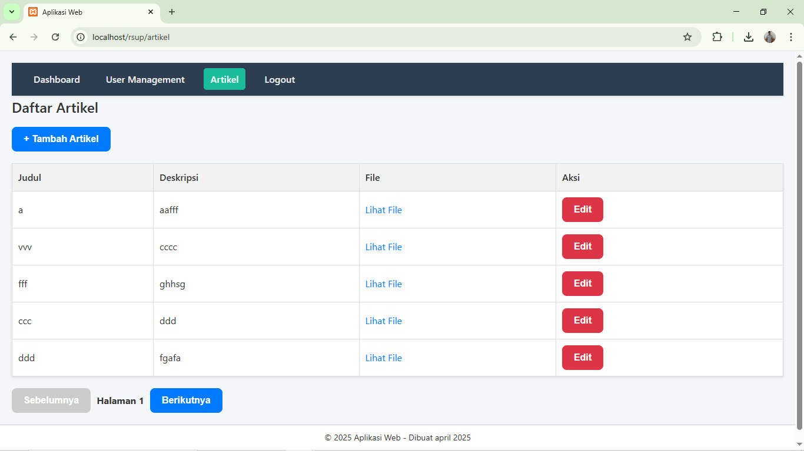

Halaman artikel dengan login sebagai user, user hanya bisa melihat tanpa bisa action apapun

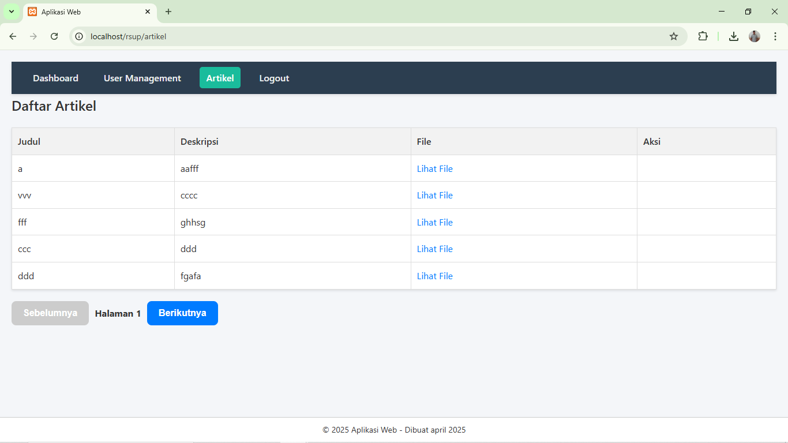

Halaman tambah artikel

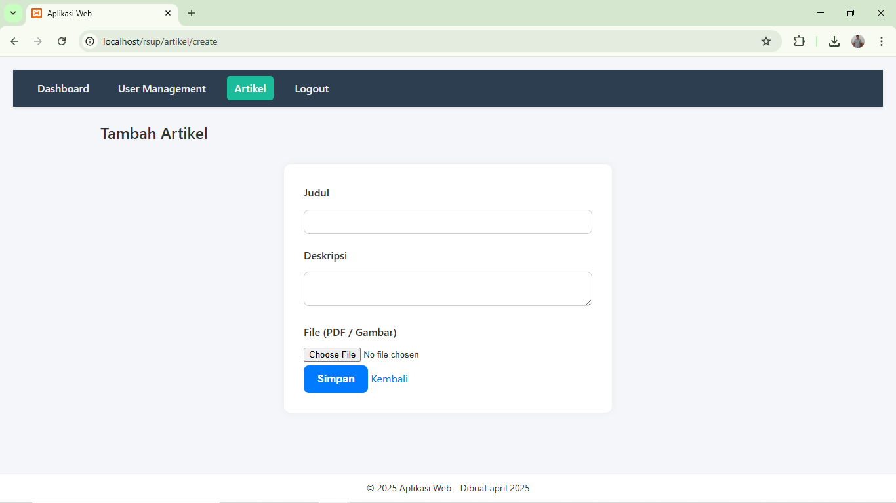

Validasi apakah type file yang diupload sesuai, yakni pdf atau Images

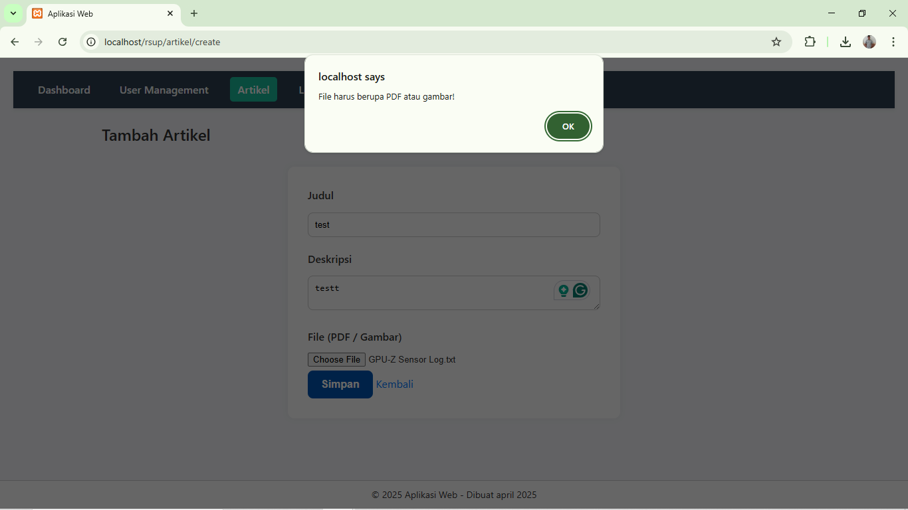

Validasi besar file yang diupload tidak boleh lebih dari 2mb
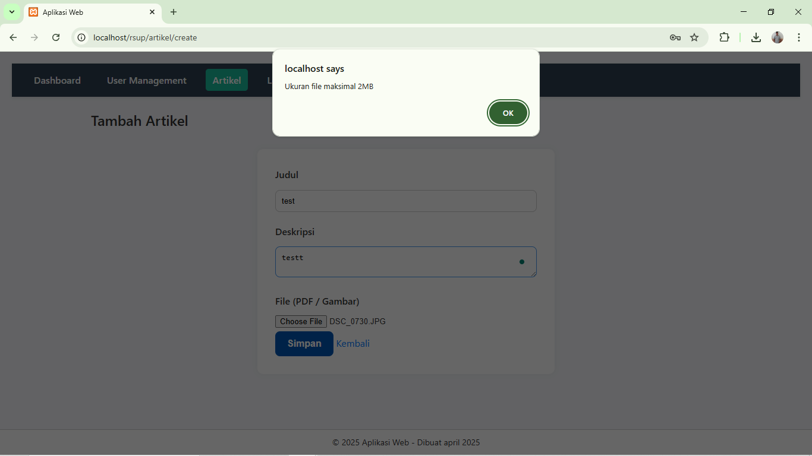

### Other
Halaman yang muncul ketika role tertentu mencoba akses halaman yang tidak diberi akses

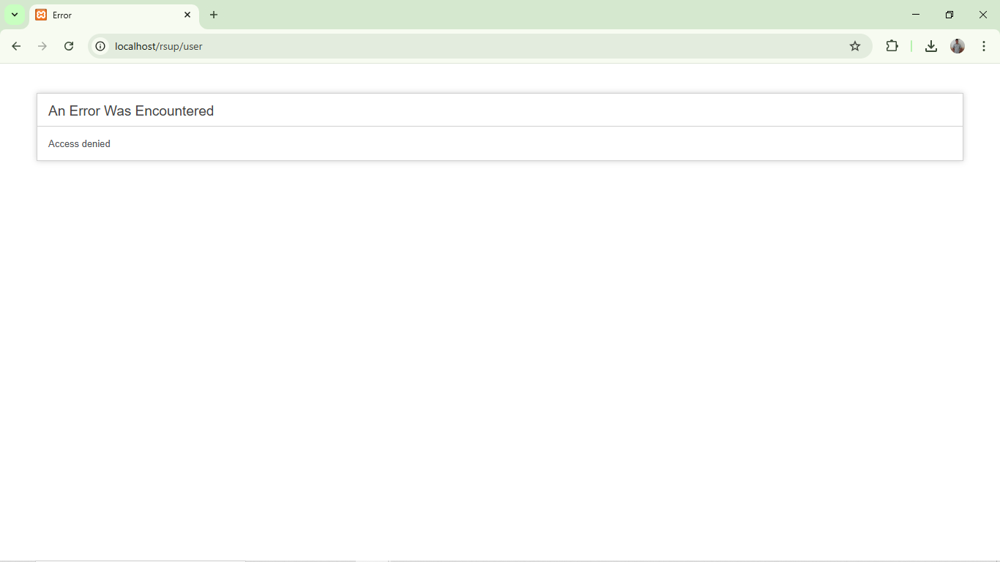

Ketika ingin memanggil API tapi tidak menyertakan Token yang didapat setelah login maka akan ditolak

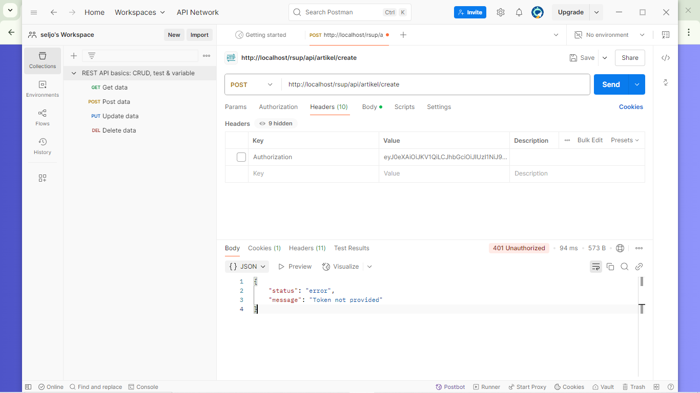

Ketika ingin memanggil API tapi menggunakan Token dari login role yang tidak sesuai maka akan ditolak


## 💡 Fitur
- Login & Logout dengan ReCaptcha
- Role-based access (Admin, Editor, User)
- CRUD User
- CRUD Artikel + Upload File (PDF/Images)
- Paginasi, Search
- RESTful API dengan autentikasi token menggunakan JWT

## 🗃️ Database

File schema database bisa ditemukan di:  
`/database/rsup_db.sql`  
Silakan import ke MySQL sebelum menjalankan aplikasi.

Atau gunakan tool seperti phpMyAdmin / DBeaver untuk import struktur database.

## ⚙️ Cara Menjalankan
1. Clone repo ini:
   ```bash
   git clone https://github.com/sellyjohan/rsup.git```
   
2. Buat database MySQL dan import database/rsup_db.sql

3. Konfigurasi koneksi DB di application/config/database.php

4. Jalankan server lokal (XAMPP)

5. Akses via browser http://localhost/rsup/

 
